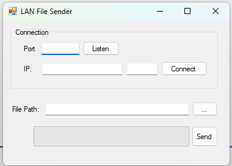

# File Transfer Application

The File Transfer Application is a simple client-server application developed in VB.NET that allows users to send and receive files over a network using TCP sockets. It uses the Winsock2005DLL to handle network connections and file transfers. The application features a user-friendly graphical interface to facilitate the transfer process.

This application was developed during my internship in Italy, where I gained hands-on experience with network programming and client-server architecture.



## Features

- **Send Files:** Select and send files to a specified IP address and port.
- **Receive Files:** Listen for incoming file transfers on a specified port.
- **Progress Bar:** Displays the progress of file transfers.

## Code Structure
### Main Form (Form1)
The main form of the application contains the following components:

**Winsock Controls:**

- ReceiveSock: Responsible for listening for incoming connections and receiving data.
- SendSock: Responsible for connecting to a server and sending data.
**Event Handlers:**

- Button1_Click: Starts the server to listen for incoming connections on the specified port.
- Button2_Click: Connects the client to the specified server IP address and port.
- Button3_Click: Opens a file dialog to select a file for sending.
- Button4_Click: Sends the selected file to the connected server.
- ReceiveSock_ConnectionRequest: Accepts incoming connection requests from clients.
- ReceiveSock_DataArrival: Handles the arrival of incoming data and files.
- SendSock_SendProgress: Updates the progress bar as data is sent.

## Prerequisites

- VB.NET development environment (e.g., Visual Studio)
- Winsock2005DLL for network communication

## Installation

1. Clone this repository:
   ```bash
   git clone git@github.com:danilo90lan/LAN_FileSender.git

2. Open the project in Visual Studio.

3. Ensure that the Winsock2005DLL library is referenced in your project.

## Usage
### Set up the receiver:

1. Enter the port number in the first text box.
2. Click the Start Listening button to accept incoming connections.
### Set up the sender:

1. Enter the IP address of the receiver in the second text box.
2. Enter the port number in the third text box.
3. Click the Connect button.
### Select a file to send:

1. Click the Select File button to open a file dialog and choose a file.
2. The file path will be displayed in the fourth text box.
### Send the file:

- Click the Send File button to transfer the selected file to the connected receiver.
### Receiving a file:

- The application will prompt for a path to save the received file.
